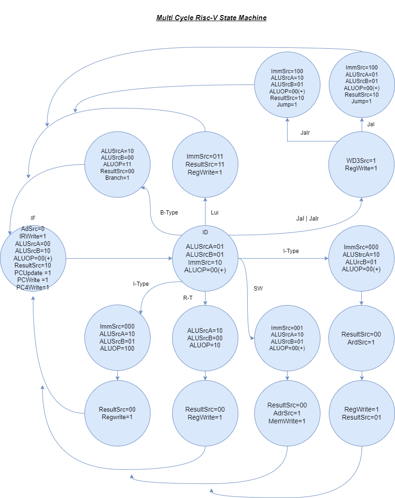
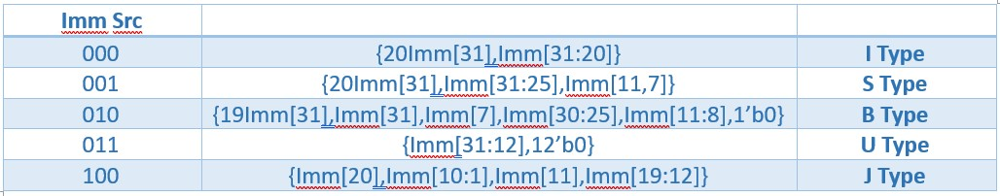
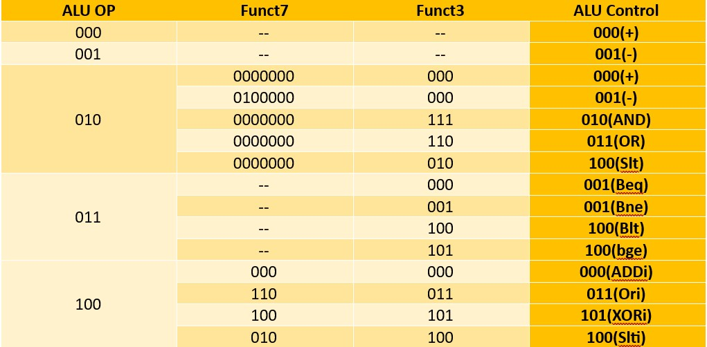

# Multi Cycle RISC-V Processor
Design and implementation of RISC-V processor with a multi-cycle datapath and controller.
## Commands

```ruby
R_Type:  add, sub, and, or, slt
```
```ruby
I_Type:  lw, addi, xori, ori, slti, jalr
```
```ruby
S_Type:  sw
```
```ruby
J_Type:  jal
```
```ruby
B_Type:  beq, bne, blt, bge
```
```ruby
U_Type:  lui
```
## Datapath


## Controller


### Immediate Extension Unit Controller


### ALU Opcode Controller


### ALU Controller


## Test Code
The following assembly code can be converted to machine code using [RISC-V Online Assembler](https://riscvasm.lucasteske.dev/#).

```ruby
addi x8,x0,30
sub x9,x8,x7
and x10,x8,x7
or x11,x8,x7
slt x12,x8,x7
slt x12,x8,x7
xori x13,x7,13
ori x14,x7,13
slti x15,x7,13
sw x8,400(x7)
jalr x16,x7,10
lui x17,50
```
## Course Description
- **Course**: Digital Systems 2 [ECE 778]
- **Semester**: Spring 2023
- **Institution:** [School of Electrical & Computer Engineering](https://ece.ut.ac.ir/en/), [College of Engineering](https://eng.ut.ac.ir/en), [University of Tehran](https://ut.ac.ir/en)
- **Instructors:** Dr. Safari
- **Contributors:** [Fardin Abbasi](https://github.com/fardinabbasi/Laplace_Transform), Soheil Abdollahi